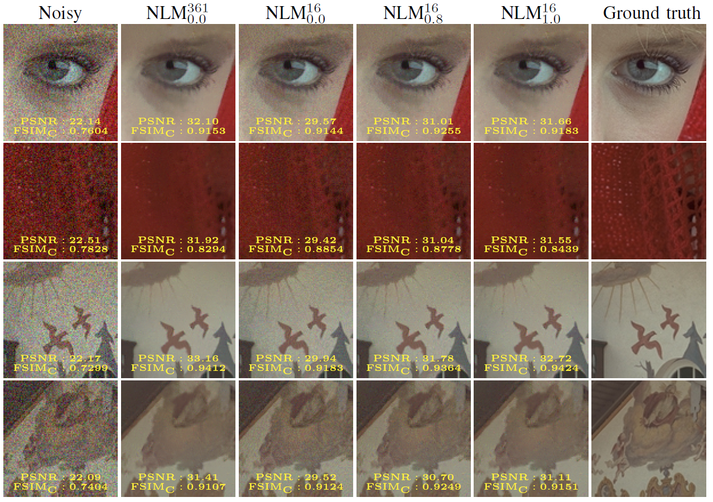

# SNN (Statistical Nearest Neighbors)

Matlab code implementation of the modified Non Local Means and Bilateral filters, as described in I. Frosio, J. Kautz, Statistical Nearest Neighbors for Image Denoising, IEEE Trans. Image Processing, 2018. The repository also includes the Matlab code to replicate the results of the toy problem described in the paper.

# License

Copyright (C) 2018 NVIDIA Corporation.  All rights reserved.
Licensed under the CC BY-NC-SA 4.0 license (https://creativecommons.org/licenses/by-nc-sa/4.0/legalcode). 

# Description

Non-Local-Means image denoising is based on processing a set of neighbors for a given reference patch. Few Nearest Neighbors (NN) can be used to limit the computational burden of the algorithm. Resorting to a toy problem, we show analytically that sampling neighbors with the NN approach introduces a bias in the denoised patch. We propose a different neighbors’ collection criterion to alleviate this issue, which we name Statistical NN (SNN). Our approach outperforms the traditional one in case of both white and colored noise: fewer SNNs can be used to generate images of superior quality, at a lower computational cost. A detailed investigation of our toy problem explains the differences between NN and SNN from a grounded point of view. The intuition behind SNN is quite general, and it leads to image quality improvement also in the case of bilateral filtering. An offset parameter o, passed as input to our algorithm, allows moving from the traditional NN approach (o = 0.0) to SNN (o = 1.0) in a continuous way. Better results are experimentally achieved for an offset o = 0.8.



The figure shows a set of 8 bits, noisy, 100 x 100 patches from the Kodak dataset, corrupted by zero-mean Gaussian noise with standard deviation 20. Traditional NLM (NLM<sup>361</sup><sub>0.0</sub>) uses 361, 3x3 patches in a 21x21 search window; it removes noise effectively in the flat areas (the skin, the wall), but it blurs the small details (see the texture of the textile, fresco details). Using 16 NNs for each patch (NLM<sup>16</sup><sub>0.0</sub>) improves the contrast of small details, but introduces colored noise in the flat areas. The proposed SNN technique (NLM<sup>16</sup><sub>1.0</sub>) uses 16 neighbors and mimics the results of traditional NLM in flat areas (high PSNR), while keeping the visibility of small details (high FSIM<sub>C</sub>, a perceptual image quality metric). Best results are achieved when patches are collected through SNN, with o = 0.8 (NLM<sup>16</sup><sub>0.8</sub>).

# Usage

**/NLM/nlm.m**: Matlab code to filter a user defined image thorugh the modified Non Local Means filter (accordinagly to the SNN approach) and user defined filtering parameters. The traditional Non Local Means filter is achieved passing offset = 0 in input.

**/NLM/runme.m**: example usage of /NLM/nlm.m.

**/BilateralFilter/bilateralFilter.m**: Matlab code to filter a user defined image thorugh the modified Bilateral filter (accordinagly to the SNN approach) and user defined filtering parameters. The traditional Bilateral filter is achieved passing offset = 0 in input.

**/BilateralFilter/runme.m**: example usage of /BilateralFilter/bilateralFilter.m.

**/ToyProblem/toyProblem.m**: Matlab code to replicate the results on the toy problem described in our paper.

**/ToyProblem/runme.m**: example usage of ToyProblem/toyproblem.m.

# References

I. Frosio, J. Kautz, Statistical Nearest Neighbors for Image Denoising, IEEE Trans. Image Processing, 2018.
```
@article{Fro18,
  title={Statistical Nearest Neighbors for Image Denoising},
  author={Frosio, Iuri and Kautz, Jan},
  journal={IEEE Trans. Image Processing},
  year={2018},  
}
```
